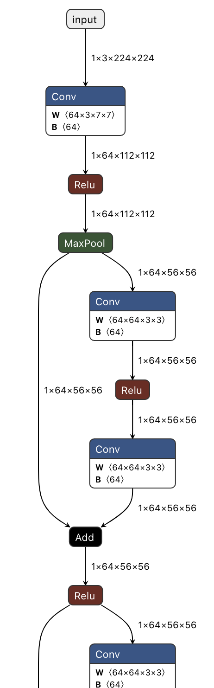
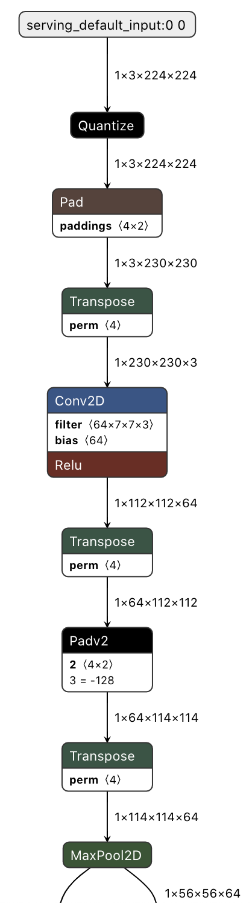

# Model converter

Convert Pytorch model to onnx or tflite, 
and the converted model can be visualized by [Netron](https://github.com/lutzroeder/netron)

You can use this project to:
1. Pytorch -> onnx (float32)
2. Pytorch -> onnx -> tflite (float32)
3. Pytorch -> onnx -> tflite (int8)

## Requirements
torch2onnx
```python
pytorch
onnx
opencv-python
```

torch2tflite
```python
tensorflow ~= 2.5
torch == 1.8.1
tensorflow-addons ~= 0.15
opencv-python ~= 4.5.4
onnx ~= 1.10
onnx-tf ~= 1.9
numpy >= 1.19
```

(opencv-python is optional)

## Usage
torch2onnx (float32)
```python
from converter import Torch2onnxConverter

converter = Torch2onnxConverter(model_path, target_shape=(3,224,224))
converter.convert()
```

torch2tflite (float32)
```python
from converter import Torch2TFLiteConverter

converter = Torch2TFLiteConverter(tmp_path, tflite_model_save_path='model_float32.lite', target_shape=(224,224,3))
converter.convert()
```

torch2tflite (int8)
```python
import torch
from converter import Torch2TFLiteConverter

dataset = torch.rand(16,3,224,224, dtype=torch.float32)
def representative_dataset():
    for data in dataset:
        data = data.unsqueeze(0) # (1,3,224,224)
        yield [data]

converter = Torch2TFLiteConverter(tmp_path, tflite_model_save_path='model_int8.lite', target_shape=(224,224,3),
                                    representative_dataset=representative_dataset)
converter.convert()
```

More details can be found in `Torch2onnxConverter` and `Torch2TfliteConverter` `__init__` method.

Note that `target_shape` is different for Pytorch and Tensorflow.

## Example
1. [torch2onnx example](test/torch2onnx_test.py) \
    

2. [torch2tflite example](test/torch2tflite_test.py) \
    

## References
- [PyTorch to TensorFlow Lite Converter](https://github.com/omerferhatt/torch2tflite)